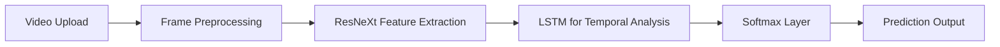

# 🧠 Deepfake Detection Using Deep Learning Techniques 

🎯 **Detect AI-manipulated videos using advanced deep learning models.**  
This project demonstrates the application of deep learning for detecting manipulated media—commonly known as deepfakes—with high accuracy and real-world reliability.

---

## 🎥 Project Overview

With the rise of generative AI, deepfakes pose serious risks to media trust, security, and personal privacy. This system uses a hybrid architecture combining **ResNeXt CNN** and **LSTM RNN** to effectively classify video content as **authentic** or **fake**. A web interface allows users to upload videos and view results with confidence scores.

> 💡 Using AI to fight AI — smart, secure, and scalable.

---

## 🧪 Key Features

- 🎥 Upload and analyze videos through an intuitive web interface.
- 🔍 Detect both face-swapped and reenacted deepfakes.
- 🤖 Models: Pre-trained **ResNeXt-50 (32x4d)** + **LSTM**.
- 📊 Returns prediction confidence and classification (Real / Fake).
- ⚙️ Trained on multiple real-world datasets for robustness.

---

## 🏗️ System Architecture



---

## 🧠 Model Design

| Component     | Function |
|---------------|----------|
| **ResNeXt-50** | Extracts high-dimensional frame features |
| **LSTM**      | Captures temporal sequence patterns |
| **ReLU, Dropout** | Enhances learning and avoids overfitting |
| **Softmax**   | Outputs prediction confidence |

---

## 🧰 Tech Stack

- **Backend**: Python 3.10, PyTorch 1.4, Django 3.0
- **Frontend**: HTML5, Bootstrap
- **Cloud/Infra**: Google Cloud Platform (GCP)
- **Libraries**: OpenCV, Face-recognition, TorchVision

---

## 🚀 Getting Started

1. **Clone the Repository**
   ```bash
   git clone https://github.com/kumar-kaushal-dev/deepfake_detection.git
   cd deepfake_detection
   ```

2. **Install Dependencies**
   ```bash
   pip install -r requirements.txt
   ```

3. **Prepare Trained Models**
   Place model files (`.pth`) inside `/pretrained_models`.

4. **Run Migrations**
   ```bash
   python manage.py migrate
   ```

5. **Start the Server**
   ```bash
   python manage.py runserver 0.0.0.0:8001
   ```

6. **Open in Browser**
   Go to `http://localhost:8001`

---

## 📈 Performance Highlights

| Model               | Accuracy | Precision | Recall | F1 Score |
|---------------------|----------|-----------|--------|----------|
| EfficientNet-B4     | 98%      | 97%       | 98%    | 97.5%    |
| Vision Transformer  | 97%      | 96%       | 97%    | 96.5%    |
| ResNeXt + LSTM (Ours)| ✅ **Best trade-off of performance and speed** |

---

## 🔮 Future Scope

- 🌐 Build a Chrome extension for real-time detection
- 📲 Mobile app integration with lightweight model
- 💡 Extend support to full-body and audio deepfakes

---

## 👨‍💻 Developed By

**Kaushal Kumar**  
[GitHub](https://github.com/kumar-kaushal-dev) 
*Open-source enthusiast | AI & Full Stack Developer*

---

## 📚 References

- [FaceForensics++ Dataset](https://github.com/ondyari/FaceForensics)
- [Deepfake Detection Challenge](https://www.kaggle.com/c/deepfake-detection-challenge)
- [Celeb-DF Dataset](https://arxiv.org/abs/1909.12962)
- [ResNeXt (PyTorch)](https://pytorch.org/hub/pytorch_vision_resnext/)

---

## 🛡️ License

This project is licensed under the **MIT License**.

---

> “Technology can deceive — but it can also defend. Build wisely.”
